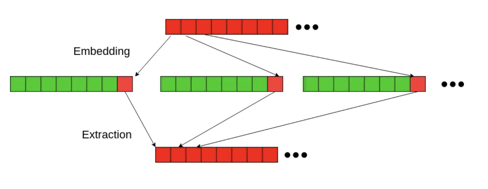

# Audio Steganography

**Audio Steganography**: the act of hiding secret messages in audio files

### Least Significant Bit (LSB) Insertion

* data is extracted from the audio file, and the bits of the message are hidden in the least significant bits of the audio file
* to extract the message, the least significant bits are extracted and the message is reconstructed

* Pros: One of the simplest methods to hide message, and LSB doesn't change the byte by much so it shouldn't be perceptible
* Cons: In an audio file, changing the LSB of every byte might generate noise that has a chance of being noticed by the human

### Modifications

*  **Increment mode** : Instead of changing the LSB of every byte, you can change the LSB of every other byte or every two or three bytes. When running our code, you can specify by how many bytes you want to skip when encoding. This number has to be provided when runnign decode as well.
*  **MSB mode** : Only change the LSB if the byte's first two bits are 11

These modes decrease the noise generated by the changing of the LSB by alternating and spreading out the bytes that are altered

### Visual
* spectograms!

