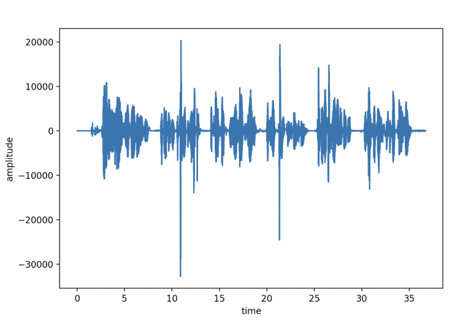
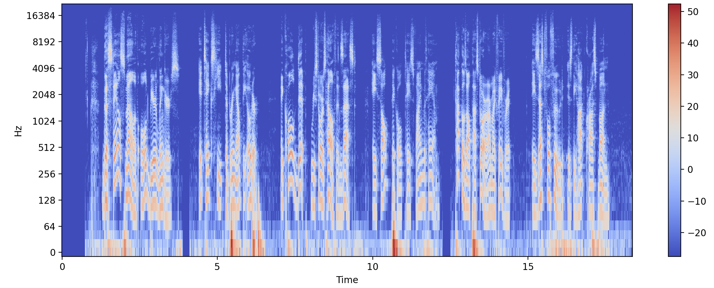
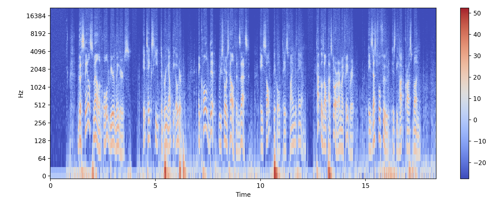
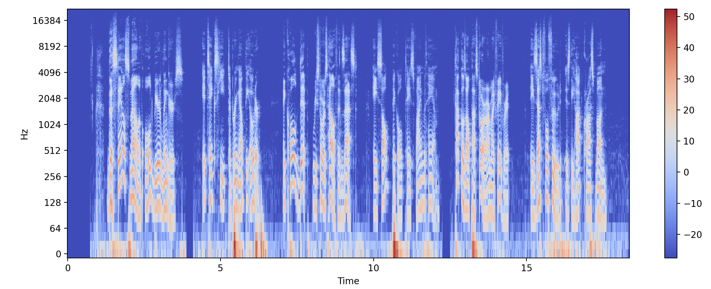
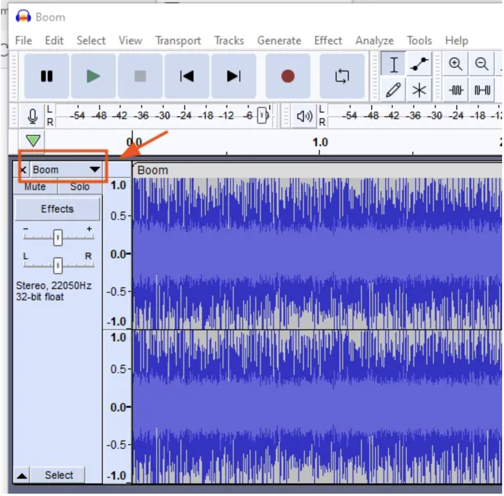
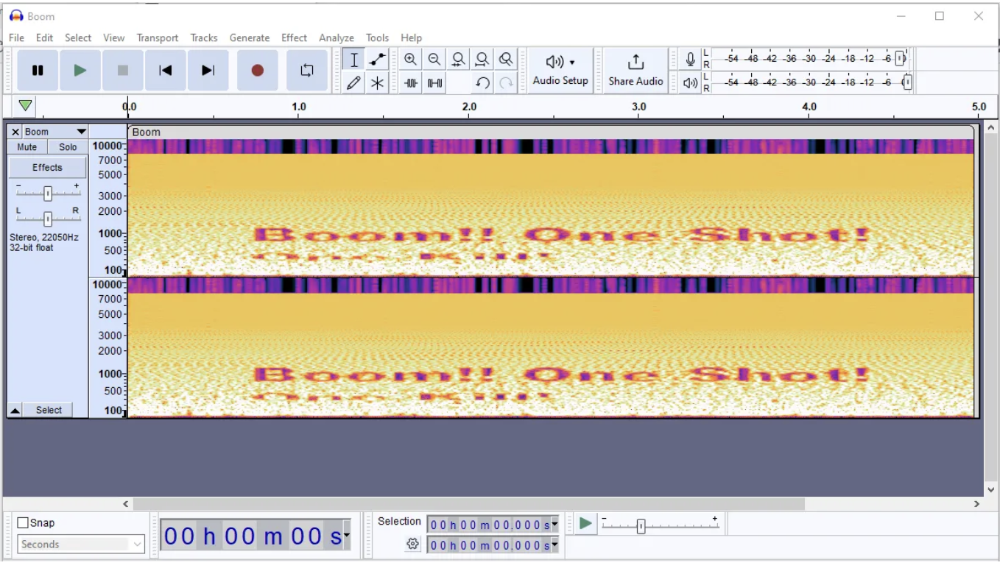

# Audio Steganography

We decided to implement a Least Significant Bit (LSB) audio steganography program for our final project. Steganography, the art of hiding information within other, seemingly innocent information, was something we all found interesting when taking this class. Completing the image processing assignment got us even more interested in the field, and we chose to write an audio version as well. Our program focused on lsb steganography. It analyzed the least significant bits - the last bit of each byte - in an audio file, compiling them all to create a hidden message. Although you can see these changes on a computer, to the human ear the changes are imperceptible, and the audio sounds virtually the same, making this an extremely effective method for sending encoded messages. Not only is it impossible to hear the message, you can hide its existence as well. 
We were also fascinated by spectrograms, after one was shown to us in class. It was a soundtrack altered to visually hide a secret message in its spectrogram. We created spectrograms like this for our audio files, in order to see what the altered tracks look like, in addition to hearing what they sound like. These visuals show the frequencies and intensities of the audio files, and can demonstrate the subtle changes made to the bytes. 

**Audio Steganography**: the act of hiding secret messages in audio files

### Least Significant Bit (LSB) Insertion

* data is extracted from the audio file, and the bits of the message are hidden in the least significant bits of the audio file
* to extract the message, the least significant bits are extracted and the message is reconstructed

* Pros: One of the simplest methods to hide message, and LSB doesn't change the byte by much so it shouldn't be perceptible
* Cons: In an audio file, changing the LSB of every byte might generate noise that has a chance of being noticed by the human

### Modifications

*  **Increment mode** : Instead of changing the LSB of every byte, you can change the LSB of every other byte or every two or three bytes. When running our code, you can specify by how many bytes you want to skip when encoding. This number has to be provided when runnign decode as well.
*  **MSB mode** : Only change the LSB if the byte's first two bits are 11

These modes decrease the noise generated by the changing of the LSB by alternating and spreading out the bytes that are altered

### Visuals

**Audio Waves** 
* Many of the changes in the bits of our audio file are not easily visible (and not easily audible!)
* Hence we can use audio wave graphs, amplitude v. time. The bits that we extract from our wav files can be recognized as the amplitudes of our wave graphs. Observe the bits here to see the sinusoidal motion the wave follows in this video: 

[Watch the video](https://drive.google.com/file/d/1_BGyMpusgloVJBtfC-T20JzYNsOdjq2y/view?usp=sharing)

Here, you can see the peaks that represent our graph. 

* Our program can generate these graphs as well 

**Spectrograms** 
* Spectrograms are a development from audio waves  that instead measure changes in frequency v. time using colors. Darker areas indicate greater frequencies, which can be observed from our program 

Use these visuals to observe differences between our modes of LSB! 

Regular LSB: 

Increment LSB: 

### Extensions to other Audio Stegonography 
 
* Can mbed data such as text messages or images into the spectrogram, then convert it back into audio.
* The audio sounds normal, but when re-spectrogrammed, the hidden content appears.
* Tools like Aphex Twin’s Equation famously used this to hide a face in a spectrogram.
* Software like Audacity and Coagula are frequently used for this. 

View this phenomenon here! 

